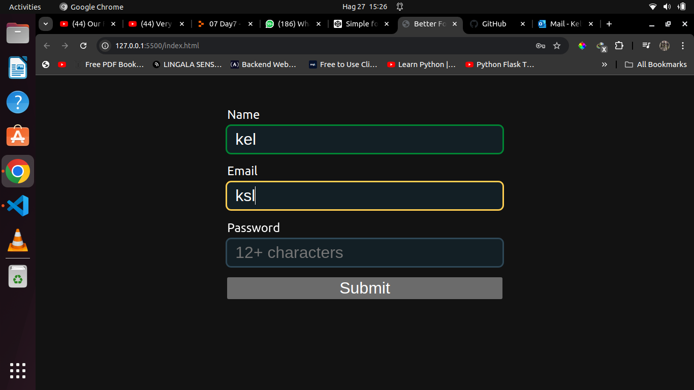
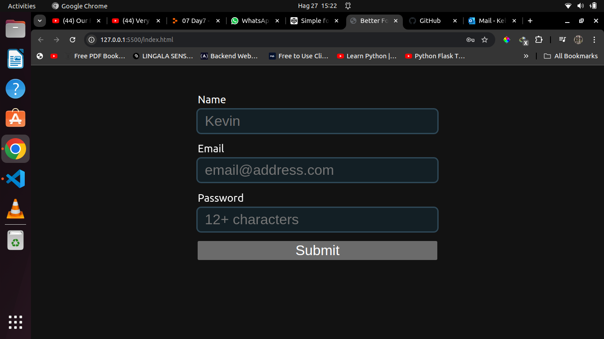
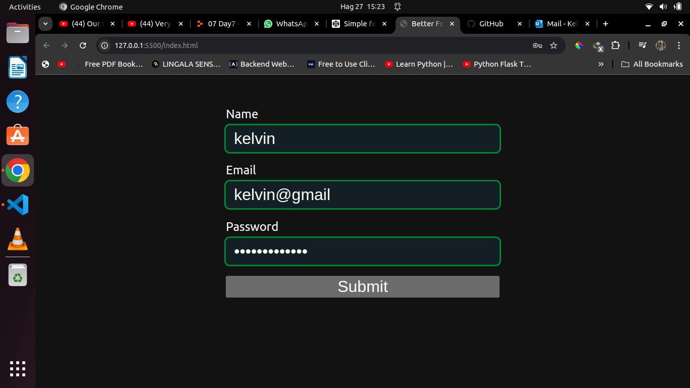

# Better forms using HTML and CSS
I have done this mini project on how we can use 
*valid and invalid* pseudo codes to have adifferent outline color when filling the form.

## About the colors

By default the forms outline will have a hcl(203, 30%, 26%) color. 

when a user fills the fome, the color will change as shown below.

if the input is invalid the outline color will be red as shown below.

if all the fields are correct the outline color will turn into green 

I give credit to *Kelvin Powell* who led this tuturials along

## License

[MIT](https://choosealicense.com/licenses/mit/)
